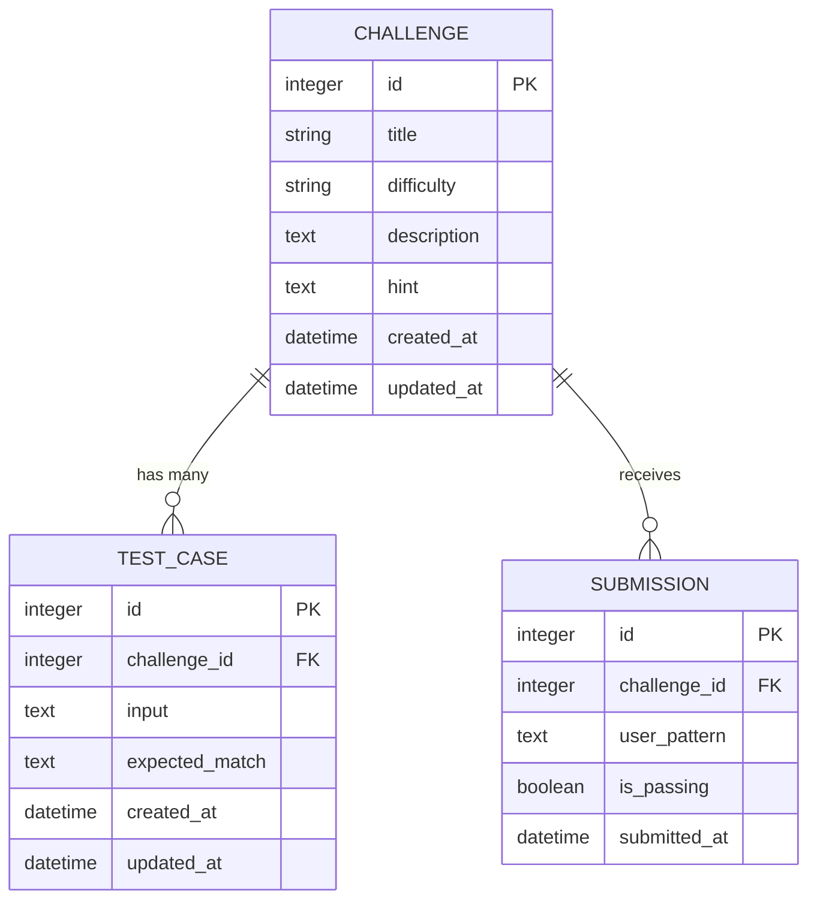

# RegexDojo Database Schema Design

This document describes the recommended database schema design for the RegexDojo application, optimized for SQLite using ROM (Ruby Object Mapper) and Hanami 3.0.

---

## 1. Relational Schema Diagram



---

## 2. Table Specifications

### `challenges`
Stores the default list of Regex exercises.

*   `id` (integer, Primary Key)
*   `title` (string, Not Null) - E.g. "Literal Matching".
*   `difficulty` (string, Not Null) - "Easy", "Medium", "Hard".
*   `description` (text, Not Null) - Detailed instructions.
*   `hint` (text, Nullable) - Hints for the user.
*   `created_at` / `updated_at` (datetime)

### `test_cases`
Stores the validation inputs and expected outputs for each challenge.

*   `id` (integer, Primary Key)
*   `challenge_id` (integer, Foreign Key pointing to `challenges.id`, Cascade Delete)
*   `input` (text, Not Null) - The test string.
*   `expected_match` (text, Nullable) - The exact substring expected to match. If null, indicates the string should *not* match.
*   `created_at` / `updated_at` (datetime)

### `submissions`
Logs user attempts for telemetry, stats, and progress tracking.

*   `id` (integer, Primary Key)
*   `challenge_id` (integer, Foreign Key pointing to `challenges.id`)
*   `user_pattern` (text, Not Null) - The regex pattern inputted by the user.
*   `is_passing` (boolean, Not Null) - Whether the pattern passed all test cases.
*   `submitted_at` (datetime, Defaults to current time)

---

## 3. Hanami 3.0 Migration Setup

To implement this schema, generate and run migrations using Hanami CLI.

### Creating the Migrations
Run the following commands inside your Hanami terminal environment:

```bash
bundle exec hanami db g migration create_challenges
bundle exec hanami db g migration create_test_cases
bundle exec hanami db g migration create_submissions
```

### Migration Code Definitions

#### `create_challenges` Migration
```ruby
# config/db/migrate/XXXXXXXXXXXXXX_create_challenges.rb
ROM::SQL.migration do
  change do
    create_table :challenges do
      primary_key :id
      column :title, :string, null: false
      column :difficulty, :string, null: false
      column :description, :text, null: false
      column :hint, :text
      column :created_at, :datetime, null: false, default: Sequel::CURRENT_TIMESTAMP
      column :updated_at, :datetime, null: false, default: Sequel::CURRENT_TIMESTAMP
    end
  end
end
```

#### `create_test_cases` Migration
```ruby
# config/db/migrate/XXXXXXXXXXXXXX_create_test_cases.rb
ROM::SQL.migration do
  change do
    create_table :test_cases do
      primary_key :id
      foreign_key :challenge_id, :challenges, on_delete: :cascade, null: false
      column :input, :text, null: false
      column :expected_match, :text
      column :created_at, :datetime, null: false, default: Sequel::CURRENT_TIMESTAMP
      column :updated_at, :datetime, null: false, default: Sequel::CURRENT_TIMESTAMP
    end
  end
end
```

#### `create_submissions` Migration
```ruby
# config/db/migrate/XXXXXXXXXXXXXX_create_submissions.rb
ROM::SQL.migration do
  change do
    create_table :submissions do
      primary_key :id
      foreign_key :challenge_id, :challenges, on_delete: :cascade, null: false
      column :user_pattern, :text, null: false
      column :is_passing, :boolean, null: false, default: false
      column :submitted_at, :datetime, null: false, default: Sequel::CURRENT_TIMESTAMP
    end
  end
end
```

### Running the Database Migrations
Execute the migration runner:
```bash
bundle exec hanami db migrate
```
This will apply the tables directly to your SQLite database file (`db/regex_dojo.sqlite`).
